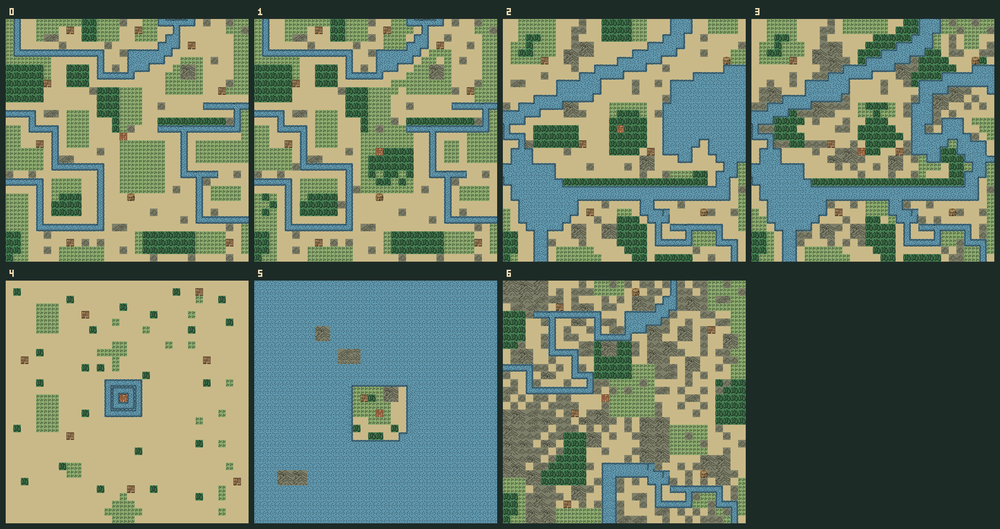

# 战场地图与手机界面全面设计（评审稿）

> **本稿的 10×9 地图方案已被否决。请改看 [18-大地图战场与手机镜头修订设计.md](18-大地图战场与手机镜头修订设计.md)。本页仅保留原版资源考据与被否决方案的历史记录。**

> 状态：**待评审，尚未接入游戏**。本稿覆盖战场大小、地形图块、每格布局、38 城归属、手机操作界面。标为“原版”的信息来自 iBaye C 源码及 `dat.lib.orig`；标为“新版”的尺寸、布局和城池归属是设计提案。

## 1. 原版资源已找回

原版 `Fight.c:FgtLoadMap` 从资源 110–116 读取 **7 张 32×32 战场地图**；`pconst.c:dCityMapId` 把 38 座城映射到其中一张。资源 4 是 **46 个 16×16、1 位色地形图块**。已将原始编号、地形分类、城池映射与图块位图导出到 [`data/classic-battle-maps.json`](../data/classic-battle-maps.json)，提取方法在 [`scripts/extract-classic-battle-maps.py`](../scripts/extract-classic-battle-maps.py)。数据来源为 [iBaye 源码仓库](https://gitee.com/bgwp/iBaye)，提取记录保存了源资源 SHA-256。




原版地形编号：1 平原、2 草地、3 城池、4 村庄、5 森林、6–15 山地、16–40 及 42–45 河流、41 营寨，0 为无效格。部分河流图块看起来像桥或岸线，但 C 逻辑中仍归为河流；新版“桥”应采用**河流上的通行设施图层**，不能仅按原图的视觉形状推断可通行。原版地形防御倍率依次为草地 1.0、平原 1.0、山地 1.3、森林 1.15、村庄 1.1、城池 1.5、营寨 1.2、河流 0.8，见 `FightSub.c:FgtGetTerrain`、`FgtCount.c:TerrDfModu`。

| 原图 | 地貌特征 | 原版分配的城市 | 新版处理 |
|---|---|---|---|
| 0 | 河流横穿、森林与平地并存 | 北平、邺、洛阳 | 借鉴河岸与林带的轮廓 |
| 1 | 水系、山林与平地混合 | 襄平、长安、小沛、宛城、寿春、武陵、建宁 | 借鉴双路线与村落位置 |
| 2 | 水面约三分之一，山地与森林夹道 | 南皮、濮阳、许昌、会稽、长沙 | 借鉴水陆绕行 |
| 3 | 水面约三分之一，山地更多 | 晋阳、河内、徐州、建业、襄阳、江夏、柴桑 | 借鉴山水交错的战术节点 |
| 4 | 大面积开阔平地，城旁少量水面 | 平原、汉中、下邳、庐江、零陵 | 借鉴开阔会战和护城河 |
| 5 | 约 94% 为水域，中心小岛 | 北海、吴、桂阳 | 只作为水战灵感，不照搬为普通陆战 |
| 6 | 山脉面积大，河道蜿蜒 | 西凉、安定、天水、梓潼、成都、棉竹、云南、巴郡 | 借鉴关隘和山间走廊 |

原版以 32×32 棋盘配合镜头移动；`FgtGetBaseXY` 根据来路设置视野/布阵方向。新版目标是一屏看全场，所以不能把原图 1:1 缩到手机，也不应把旧城池映射当作地理结论。**提取出的图块和地图是考据/美术参考；公开发行前须核查该资源的许可，正式美术可据此重绘。**

## 2. 核心体验和地图尺寸

**新版战场统一为 10 列 × 9 行，共 90 格。** 当前实现为 10×8；增加一行是为了容纳“正门 + 侧路 + 部署缓冲区”，仍能在竖屏看到全图。原版 32×32 保留在参考数据中，不作为手机实际操作尺寸。

| 手机宽度 | 地图可用宽度（左右各留 8px） | 单格宽度 | 9 行地图高度 |
|---:|---:|---:|---:|
| 320px | 304px | 30.4px | 274px |
| 360px | 344px | 34.4px | 310px |
| 390px | 374px | 37.4px | 337px |

这些是设计边界，不假装 30px 地图格符合大按钮尺寸。地图格采用**点一次选中、下方大按钮确认**；点中格子会有坐标框、放大预览和单位信息，允许在确认前改选。操作按钮至少 44px 高。极矮屏按可用高度收缩格子，但不可让整个网页上下滚动；如高度不足，单位情报折叠为一行，菜单用覆盖层。横屏把详情/指令移到右侧，地图仍完整显示。

视角规则：战场逻辑坐标固定 10×9；攻方从战略地图相邻城的来路推得八方向。**地图内容不机械旋转**，而是为四条主边预置部署/核心方向，斜向来路落在相邻边的角部部署区。每个模板绘制基准版（攻方从西侧来）；东侧镜像，北/南侧使用同主题的纵向布局变体。这样始终保持 10×9，城门、桥与河流也能按实际来路摆放。首版至少完成东西两侧，其余方向未配完前，UI 明示“由北/南进入”的战术示意，且出兵/路径均按对应边生成，不能只换标签。

## 3. 地形层与视觉规范

每格分四层：**基础地形**（八种，唯一）、**设施**（桥、渡口、城门、寨门、道路）、**动态状态**（火、水淹、毒雾、天气湿润）和**单位/交互**（阵营、兵力、选中、移动/攻击/技能范围）。规则只读结构化地形与设施，不从图片颜色判断。

| 地形 | 画法（原版图块作为参考） | 一眼能看出的轮廓 | 新版摆放约束 |
|---|---|---|---|
| 平原 `P` | 暖黄土、少量车辙与碎石 | 最亮、最低纹理密度 | 主通道和骑兵展开区；连续 3 格以上才像道路 |
| 草地 `G` | 低饱和绿、短草 2–3 变体 | 与平原同高，带绿色点纹 | 作为平原与森林/水岸过渡带，避免随机撒点 |
| 森林 `F` | 深绿树冠、边缘半透明疏林 | 成片树冠而非单颗树 | 每片 2–6 格；留 1–2 格宽的清晰行军道 |
| 山地 `M` | 灰褐山脊、亮面/阴影朝向一致 | 阶梯形山线 | 组成山脉，不单格孤山；要有至少两处可行缺口 |
| 河流 `W` | 靛青水面与水流方向纹 | 水面连贯，有岸线 | 连到地图边缘或湖泊；不能无源头断流 |
| 村庄 `V` | 低矮屋顶和篱笆 | 独立屋舍图标 | 位于道路/河岸，距城池至少 2 格；可作为支线目标 |
| 营寨 `K` | 木栅和旗 | 木栅一圈，阵营旗独立 | 位于守军外围、路口或渡口，不覆盖城池核心 |
| 城池 `C` | 城墙、门楼、旗号 | 唯一大目标，外框跨格绘制 | 逻辑上占 1 格，视觉可溢出到邻格上方；周围有可进入的门道 |

桥 `B` 表示基础地形 `W` + `bridge` 设施，桥面允许陆军通过；渡口保留 `W`，仅适用有渡河能力的兵种/技能。各地形的进入消耗、兵种限制和防御系数以战斗规则表为准。新版如果要增加“城墙”阻挡，则应单列 `wall` 设施，视觉和碰撞同时配置；不能画了墙却仍允许穿行。

绘制建议：原版 16px 图块只用于确立像素节奏；新版每格以 32px 逻辑像素绘制，可按最近邻放大，不做模糊插值。地形底色压暗，行动高亮放在独立半透明边框层：青色虚线＝可移动，朱红双边框＝可攻击，紫色角标＝技能，黄色斜纹＝危险，白色实框＝当前选格。附图标/纹理，不能只靠颜色。单位小头像或兵种符号居中，阵营色在外圈，兵力条放格底；地形图形仍能从四角读到。天气改变光照和粒子层，**不改变地形底色的身份**。

## 4. 七种可制作的 10×9 布局

以下是**逐格布置草图**，不是原版地图的缩小图，也尚未进入游戏。基准方向：攻方从左侧第 0–1 列部署，守方围绕右侧的 `C`，城池核心在 `(8,4)` 附近。每行 10 格，从上到下 `y=0…8`；符号是基础地形，`B` 是河流+桥。实际地图数据另存 `terrain` 和 `fixture` 两层。每图给攻方至少两条路线，不设置不可解的单格入口。

### A. 中原平原：视野开阔、侧翼森林

```text
GGGPPPPGGG
GGPPPPPPGG
PPPPFPPPPP
PPPVFPPPKP
PPPPPPPPCP
PPPPPPPPPP
PPPFPPVPPP
GGFFPPPPGG
GGGPPPPGGG
```

城池核心位于 `(8,4)`，其前方一格可用 `gate` 设施绘制门楼；北侧可绕林、南侧经村，中央适合骑兵。核心城市：北平、南皮、邺、平原、濮阳、许昌、小沛。

### B. 关隘山城：两处山口、营寨控路

```text
MMMMGGMMMM
MMPPPPMMMM
MPPPPPPMMM
PPPPMMPPPP
PPPKMMPPCP
PPPPMMPPPP
MMPPPPPMMM
MMMPPPMMMM
MMMMGGMMMM
```

山脊分隔北部捷径与中部关口；守军营寨压住主口，南侧路更长。**山地并非绝对不可走**，骑兵代价高，步兵可爬；必须在配置里验证两条可达路。核心城市：西凉、安定、天水、晋阳、河内、汉中、梓潼、棉竹、巴郡、云南、建宁。各城可调山脊方向和寨的位置。

### C. 林间盆地：林带遮挡与村落支线

```text
GGFFFFFFGG
GPFFFPPFGG
PPFPPPPPPP
PPFPPPVPPP
PPPPPPPPCP
PPPPPPFPPP
GGFFPPFPGG
GGFFPPPPGG
GGGPPPGGGG
```

上方林带提供掩护，中部是明确道路，下方以村落/树林形成侧翼。核心城市：襄平、武陵、零陵、桂阳。襄平使用偏寒色草甸，湘南三城增加湿润林地和水田装饰；地形规则不靠换肤改变。

### D. 河桥要冲：双桥、争渡口

```text
GGPPWWPPGG
GPPPWWPPGG
PPPPBBPPPP
PPPPWWPPKP
PPPPWWPPCP
PPPVWWPPPP
PPPPBBPPPP
GGPPWWPPGG
GGPPWWPPGG
```

第 4–5 列是连续水道，第 2/6 行各有一处双格桥面；城前营寨和村庄使上下桥有不同收益。水军可走河道，陆军从桥通过。核心城市：徐州、下邳、寿春、襄阳、江夏、柴桑、长沙。

### E. 江淮水网：水系分叉、三处陆路入口

```text
GGPPWWGGGG
GPPPWWPPGG
PPPPBBPPPP
PPPPWWPPVP
PPPPWWPPCP
PPPPBBPPPP
PPPPWWPPPP
GGPPWWPPGG
GGPPWWGGGG
```

中段水路形成两处过河路径：北桥直达、南桥靠近村庄；两处 `B` 都与相邻岸格连通。正式美术可在水面绘出支流，只有配置了桥的格子允许陆军进入。核心城市：北海、庐江、建业。建业追加城前外郭轮廓，北海添加海岸装饰，庐江突出双支流。

### F. 海港/登陆：大片水面但陆军可打

```text
WWWWWPPGGG
PPWWWPPPGG
PPBBBPPPPP
PPWWWPPPPP
PPWWWPPPCP
PPWWWPPPPP
PPBBBPPPPP
PPWWWPPPGG
WWWWWPPGGG
```

港口地图应约三至四成水域，不复制原版 5 号图约 94% 水域。攻方陆军从左侧沙洲出发，经上、下两条栈桥进攻，水军从水面切入；城池核心在 `(8,4)`。核心城市：吴、会稽。只有当来路是水上路线时使用登陆版；普通陆路攻城改用同城的水网版。

### G. 都城/重镇：外营、护城河、双门

```text
GGPPPPPPGG
PPPPKPPPPP
PPPPPPWWPP
PPPPPPBBPP
PPPPPPWWCP
PPPPPPBBPP
PPPPPPWWPP
PPPPKPPPPP
GGPPPPPPGG
```

两座外营控制前沿；城前的护城河留上下两门，攻方可先拔营或绕侧门。核心城市：洛阳、长安、宛城、成都。成都版本的水层改为近城河，长安版本外观加土色城墙；不凭城市名临时改变通行规则。

> 制作规范：上面的字符图用于讨论轮廓与战术路线，需经美术和数据制作转为**每行严格 10 格**的配置；每图必须验证城池唯一、双路线、陆军与水军出生格合法、守军不堵死全部入口。

## 5. 38 座城的场景归属与城市辨识

| 模板 | 城市（38 座城各归属一次） | 城市特征化规则 |
|---|---|---|
| A 平原 7 | 北平、南皮、邺、平原、濮阳、许昌、小沛 | 北平草甸；邺城郊村；许昌官道；小沛小型寨 |
| B 关隘 11 | 西凉、安定、天水、晋阳、河内、汉中、梓潼、棉竹、巴郡、云南、建宁 | 西凉风沙山口；汉中盆地入口；成都近旁的梓潼/棉竹多山道；云南/建宁湿热山林 |
| C 林间 4 | 襄平、武陵、零陵、桂阳 | 襄平北地林带；荆南三城的林、村、湿地装饰各异 |
| D 河桥 7 | 徐州、下邳、寿春、襄阳、江夏、柴桑、长沙 | 下邳护城河；襄阳大河渡口；柴桑江岸营垒 |
| E 水网 3 | 北海、庐江、建业 | 北海海岸；庐江支流；建业外郭与江岸 |
| F 海港 2 | 吴、会稽 | 吴城港湾；会稽海陆双入口；陆路来袭启用 E 的变体 |
| G 重镇 4 | 洛阳、长安、宛城、成都 | 洛阳宫城轮廓；长安关门；宛城前哨；成都内外城 |

模板决定战略结构，城市签名决定 1–3 处**固定地标**与外观。每座城的布局必须随剧本保持稳定，不能每次出征随机洗牌。城池建筑等级只改变寨/城墙的状态或守军布阵，不悄悄增删唯一通路。天气由地区权重决定：西北干燥多风，荆南湿润多雨，北境偏冷；天气特效覆盖在地图上，不在开战时重排地形。

## 6. 手机界面：单屏完成一轮行动

```text
┌ 晋阳攻城   第 03/12 回合  ☔雨  ⋮ ┐  顶栏：返回、目标/回合/天气
│ 我军 2,870     敌军 1,940     粮 7 │  状态条：双方总兵力、补给
├────────────────────────────────┤
│       10×9 全景地图，无拖动        │  地形、单位、范围、目标常驻
│     [选格信息浮签，避开手指]       │
├────────────────────────────────┤
│ 赵云 骑兵  980  HP 72  MP 18     │  当前武将卡；点开完整情报
│ 山地：移动 +2   预计伤兵 120–150 │  按所选地形/目标实时更新
├────────────────────────────────┤
│ [移动] [攻击] [计谋] [待机]        │  只显示合法动作，禁用给原因
│ [撤销走位]       [结束我方回合]   │  固定操作区，适配底部安全区
└────────────────────────────────┘
```

以 320×568 为最低竖屏校核：顶栏 42px、状态条 32px、地图 274px、武将/选格卡 70px、动作区 104px、底部安全区按设备补齐，总和 522px + 安全区；安全区较大时压缩情报卡到 48px，地图按剩余高度计算，不使页面滚动。按钮不得用地图格子的 30px 命中区规格。横屏为左地图右情报/指令的两栏布局，点击流程一致。

交互状态机：

1. **无选中**：点己军显示可移动范围、当前位置可攻击目标、当前地形加成。点敌军只查看情报；点地形显示简短浮签。
2. **已选武将**：底部优先给“移动 / 攻击 / 计谋 / 待机”。点击“攻击”后，合法目标绘红框；如果当前无法攻击，按钮可点开原因说明（距离、遮挡、已行动）。
3. **选移动目标**：第一次点格预览路线、移动消耗和落点受击风险；底部出现大尺寸“确认移动”。确认后仍可选攻击/计谋。行动前允许撤销移动。
4. **选攻击/技能目标**：第一次点目标显示范围掩码、伤兵预估、地形/天气影响；底部确认一次即可执行。计谋列表在半屏抽屉，选技能后抽屉退下，地图保持完整可点。
5. **动作结果**：地图上弹出简短数字/状态，底部卡更新；击破、夺城、断粮等核心战况才用遮罩弹窗。结束回合后播放敌方动作，关键事件可停留 0.8–1.5 秒；玩家可快进。

手势：单击选中、再次点击改选；长按地形/单位打开详情；两指缩放和拖动**不作为必需操作**。用户手指遮挡格子时，在目标格上方显示放大浮签并根据屏幕边缘自动翻转位置。操作优先由引擎返回合法范围，UI 不自行计算地形可走性。

## 7. 数据结构、制图流程与落地顺序

地图配置建议一城一份轻量描述：

```js
{
  cityId, templateId, approach: 'W' | 'E' | 'N' | 'S' | 'NW' | 'NE' | 'SW' | 'SE',
  width: 10, height: 9,
  terrain: ['PPGG...'], // 9 行，每行 10 格；实际以地形枚举保存
  fixtures: [{ x: 4, y: 2, type: 'bridge' }],
  cityCore: { x: 8, y: 4 },
  attackerSpawns: [{ x: 0, y: 2 }, { x: 0, y: 4 }, { x: 0, y: 6 }],
  defenderSpawns: [{ x: 7, y: 3 }, { x: 8, y: 5 }],
  citySignature: ['north_gate', 'river_bank'],
  palette: 'north_dry', weatherWeights: { /* region weights */ }
}
```

`classic-battle-maps.json` 是**原版档案**；新版地图数据另建 `battle-map-templates` 与 `battle-city-scenes`，不能覆盖原件。以 `BattleCore` 为唯一寻路/通行入口，UI 从合法动作得到高亮。美术资源按图层独立替换，今后迁移微信小游戏 Canvas 时，地图数据及规则无需重写。

实施顺序：① 将 7 张模板制成严格的 10×9 配置并完成方向变体；② 38 城绑定、桥/城门/村寨设施和双路线校核；③ 建立地形图块、单位标记与状态叠层；④ 重做单屏战斗 UI 的选择/预览/确认；⑤ 接入天气和城市签名外观；⑥ 用晋阳出征、洛阳攻城、襄阳争桥、吴城登陆四个实际流程作验收。此前不把字符草图直接作为可玩的正式地图。

### 本轮请评审的关键决定

1. **统一 10×9、一屏看全图**是否符合你想要的手机战斗节奏。
2. **38 城按地貌重新归组**是否接受；尤其汉中改山口、桂阳改林间、吴/会稽改海港。
3. 美术方向：保留 16px 原版图块的像素节奏，绘制 32px 新图块和清晰 UI；原始位图只作考据/参考。
