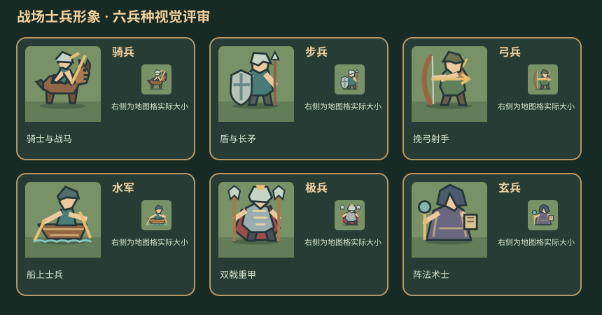

# 战场兵种形象视觉评审

每个角色使用 64×64 的绘制坐标，输出为 32×32 透明 SVG；评审图同时展示放大预览和战场显示尺寸。用户已确认这版方向，六种角色已接入游戏的兵种图片路径。

| 兵种 | 识别特征 | 形象文件 |
| --- | --- | --- |
| 骑兵 | 骑士跨坐战马，手持长枪 | [骑兵](assets/army-sprite-review/cavalry.svg) |
| 步兵 | 正面立姿，盾牌与长矛 | [步兵](assets/army-sprite-review/infantry.svg) |
| 弓兵 | 挽弓搭箭，背负箭囊 | [弓兵](assets/army-sprite-review/archer.svg) |
| 水军 | 士兵站在船上，配桨与水纹 | [水军](assets/army-sprite-review/navy.svg) |
| 极兵 | 重甲、披风、双戟 | [极兵](assets/army-sprite-review/elite.svg) |
| 玄兵 | 兜帽长袍、法杖、卷轴 | [玄兵](assets/army-sprite-review/mystic.svg) |

## 视觉规则

- 六种兵种保持同一视角、深色轮廓和有限色板；以人物、坐骑、兵器区分类型。
- 战场中兵种图占一格；兵力、武将名、行动状态仍由界面文字与标记表达。
- 阵营归属采用单位脚下的底色或角标，不改变兵种的主要形象。
- 后续可依据实际手机显示效果微调轮廓和兵器比例。

样稿由 [绘制脚本](../scripts/draw-army-sprite-proposals.py)生成。
