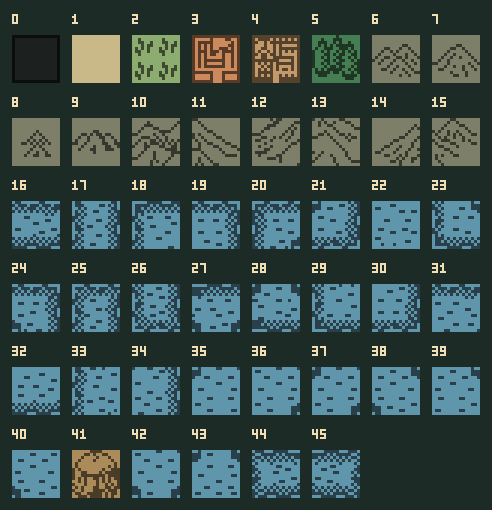
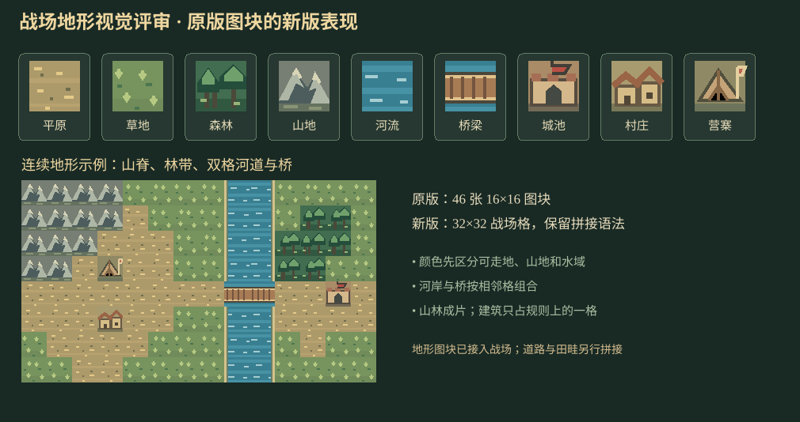

# 战场地形视觉评审

原版图块与新版样稿：

## 从原版继承的内容

原版战斗资源共有 **46 张 16×16 图块**：0 为无效边界，1 为平原，2 为草地，3 为城池，4 为村庄，5 为森林，6～15 为山地变化，16～40 与 42～45 为水域及岸线变化，41 为营寨。此分类来自项目已提取的[原版地图资源数据](../data/classic-battle-maps.json)。山地和水域有大量变化块，是为了让大地貌在 32×32 地图上连续成形。

## 本次设计

| 地形 | 玩家一眼要看出的信息 | 视觉处理 |
| --- | --- | --- |
| 平原、草地 | 普通通行区域 | 用土黄和草绿区分，纹理低对比，给士兵留清晰背景 |
| 山地 | 难行与遮挡 | 灰色山脊成片布置，亮面和暗面可拼成连续山势 |
| 森林 | 林带与伏击区域 | 深绿树冠成片，边缘比草地更暗 |
| 河流 | 陆军不可直接通过 | 蓝色水面、浅色水纹及岸线，水面在相邻格连续 |
| 桥梁 | 陆军可越河的窄口 | 木桥横穿水面，端部对准两岸道路；保持明确的通行标记 |
| 城池、村庄、营寨 | 不同战场节点 | 城门、屋舍和军帐各有独立轮廓，地形规则仍按单格判定 |

配色与已确认的六种士兵形象统一，使用清楚的深色轮廓和有限色板。样稿中的连续地图只是拼接示范，不代表某座城市最终的 32×32 地形。正式制作需要按原版 7 张地图的山水拓扑及新版各城特征安排地形，桥梁的数量和位置由可玩路线决定。

## 接入记录

用户确认方向后，已将九类基础图块接入战场，并为河流生成 16 种四向岸线组合、桥梁生成横竖两种朝向、平原/草地/山地/森林各生成 3 种纹理变化。战场渲染调用 [`TerrainVisuals.js`](../src/game/TerrainVisuals.js)，根据地形及相邻格选图。地形类型和通行规则保持独立，水面图案不会使普通河流变成可通行桥梁。

地图上原版的 7 张地形拓扑仍由 [`BattleMaps.js`](../src/game/BattleMaps.js) 负责；本次改动只涉及外观，没有移动城池、河流或部队。

图块与评审图由[绘制脚本](../scripts/draw-terrain-review.py)生成，实际游戏资源放在 [`src/assets/images/terrain/`](../src/assets/images/terrain/)，评审图保存在 [terrain-review](assets/terrain-review/) 目录。

手机预览曾出现整张战场只剩底色、士兵图同时消失的情况。为避免开发服务器旧进程拒绝新加入的 SVG 路径，运行时将 SVG 集合打包进 [`BattleArt.js`](../src/game/BattleArt.js)，由游戏脚本直接提供图像数据；源 SVG 仍是可编辑母版。修改素材后运行 [`draw-battle-svg.py`](../scripts/draw-battle-svg.py) 同步图块与图集。

随后补上道路和农田的视觉层：依据攻方布阵点与城池核心生成两条连贯的行军道路，平原/草地按相邻道路方向选择 16 种拼接瓦片；北方开阔战场加入稀疏田畦。道路也绘在缩略图上。它们只帮助玩家辨识方向，当前不会改变移动消耗或战斗数值。

战场地形现绘制在一张完整画布上，透明格子按钮处理点击、单位与范围高亮。后续截图确认明显的金色格线并非图片缩放接缝：未选中武将时，空格子的 `unit?.id` 与 `chosen?.id` 都是 `undefined`，旧判断误把所有空格子标为 `selected`，从而画出选中描边。已要求选中武将和格内单位同时存在，并将金色描边限定在我军单位格。单格素材和地形逻辑不变。
